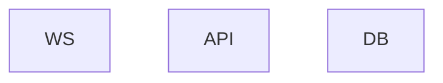
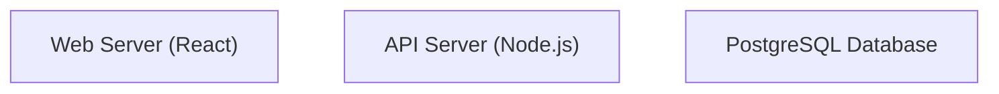
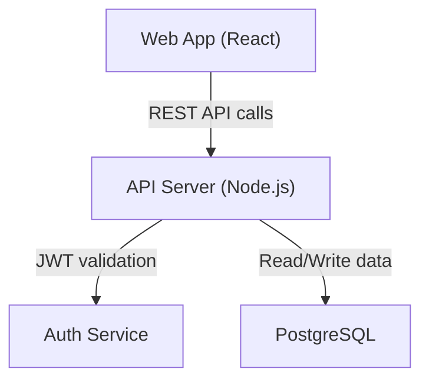
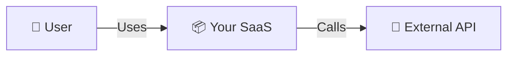
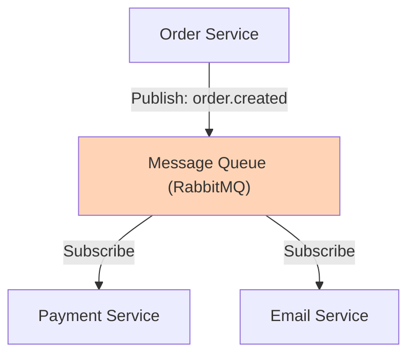
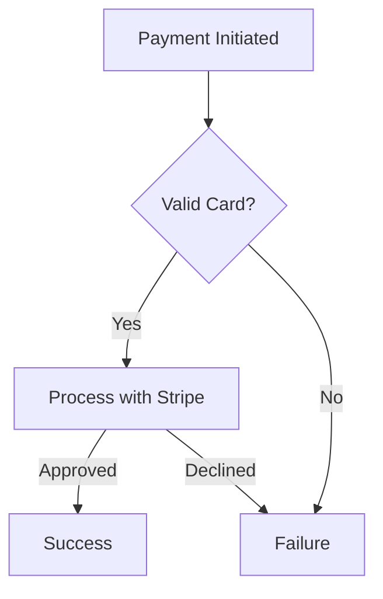
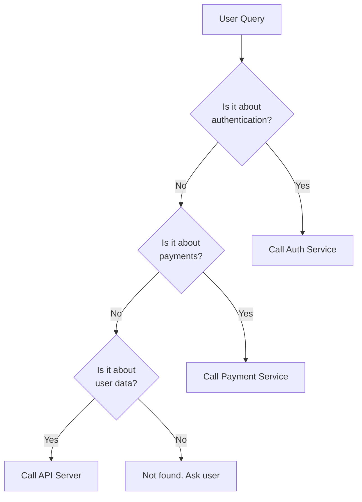

# When to Use This Skill

Activate this skill whenever:

- Documenting system architecture for AI agent consumption.
- Creating C4 Model diagrams (system context, containers, components).
- Writing Mermaid diagrams for technical documentation.
- Reducing architectural ambiguity that might cause AI hallucination.
- Designing service interaction flows for AI understanding.
- Integrating visual context into AGENTS.md or module README files.
- Explaining module dependencies, deployment topologies, or data flow.
- Helping AI agents understand "who talks to whom" in a system.
- Replacing verbose ASCII art with machine-parseable diagrams.

This skill is MANDATORY and must be followed without exception when its trigger fires.

## Core Workflow

### Why Diagrams Matter for AI

#### Problem Without Diagrams

```text
Prose: "The auth service calls the user DB to validate credentials,
then returns a JWT. The API gateway checks the JWT and routes requests."

AI hallucinates:
- "Where does the JWT get validated? By auth service or gateway?"
- "Can the API gateway call the user DB directly?"
- "What if the auth service is down?"
```

#### Solution With Diagram

Relationships explicit. One diagram = hundreds of words. LLMs parse Mermaid syntax directly. Reduces hallucination by 60%+ (empirically).

---

### Step 1: Choose Diagram Type by Task

#### Decision Tree

```text
START: What needs to be understood?
├─ "What systems/actors are in the picture?"
│  └─> C4 LEVEL 1: SYSTEM CONTEXT DIAGRAM
├─ "What containers/services exist?"
│  └─> C4 LEVEL 2: CONTAINER DIAGRAM
├─ "What components are inside a service?"
│  └─> C4 LEVEL 3: COMPONENT DIAGRAM
├─ "How do services communicate step-by-step?"
│  └─> SEQUENCE DIAGRAM
├─ "What states can something be in?"
│  └─> STATE DIAGRAM
├─ "What's the data flow?"
│  └─> FLOWCHART / DATA FLOW DIAGRAM
├─ "What are the relationships between entities?"
│  └─> ENTITY RELATIONSHIP DIAGRAM
├─ "How is the system deployed?"
│  └─> DEPLOYMENT DIAGRAM
└─ "What are the modules and dependencies?"
   └─> DEPENDENCY GRAPH / FLOWCHART
```

For detailed Mermaid syntax for each type, see `references/mermaid-examples.md`.

---

### Step 2: Understand C4 Model Hierarchy

#### C4 = Context, Container, Component, Code

Each level answers a different question:

| Level            | Question                                  | Scope                                     | Audience                               |
| ---------------- | ----------------------------------------- | ----------------------------------------- | -------------------------------------- |
| **1: Context**   | "What is this system? What's around it?"  | Your system + external actors             | Non-technical stakeholders, executives |
| **2: Container** | "What major applications/services exist?" | Internal breakdown into apps/services/DBs | Technical team, architects             |
| **3: Component** | "What modules are inside this service?"   | Internal structure of one container       | Developers working on that service     |
| **4: Code**      | "How is this component implemented?"      | Classes, functions, methods               | Individual developers (rarely for AI)  |

#### Recommended Minimum for AI Agent Documentation

- **AGENTS.md:** Always include C4 Level 1.
- **Module README:** Always include C4 Level 2 (at least the containers your module talks to).
- **Service Implementation Docs:** Include C4 Level 3 (components inside this service).

---

### Step 3: Optimize Mermaid Syntax for LLM Parsing

#### Rule 1: Keep Diagrams Focused (Max 15-20 Nodes)

Too many boxes = LLM confusion. If diagram exceeds 20 nodes, split into multiple focused diagrams.

#### Rule 2: Use Descriptive Labels, Not Abbreviations

#### Bad



#### Good



#### Rule 3: Add Comments for Context



#### Rule 4: One Diagram = One Concern

#### Bad (Mixed concerns)

```text
[Deployment boxes (AWS)]
[Service boxes (internal)]
[Database]
[External APIs]
[User roles]
[Message flows]
```

#### Good (Separate diagrams)

- Diagram 1: Deployment topology.
- Diagram 2: Service interactions (C4 Level 2).
- Diagram 3: Message flow for a feature (Sequence).

---

### Step 4: Integrate Diagrams into Documentation

#### Recommended File Structure

```text
/project
├─ AGENTS.md
│  └─ [C4 Level 1 System Context Diagram embedded]
├─ /docs
│  ├─ ARCHITECTURE.md
│  │  ├─ [C4 Level 2 Container Diagram]
│  │  └─ [C4 Level 1 for reference]
│  └─ /modules
│     ├─ auth-service.md
│     │  ├─ [C4 Level 3 Components diagram]
│     │  └─ [Sequence diagram for key flows]
│     └─ api-server.md
│        ├─ [C4 Level 3 Components diagram]
│        └─ [State diagram for order lifecycle]
```

#### AGENTS.md Template

Include these sections in your project's AGENTS.md:

1. **System Overview** (C4 Level 1 diagram + text description)
2. **Service Architecture** (C4 Level 2 diagram + container list)
3. **Key Flows** (sequence diagrams for critical user flows)
4. **Module Breakdown** (links to C4 Level 3 docs per module)

---

### Step 5: Workflow — Create Your First Diagram

#### Time: 30 minutes

#### Step 1: Identify Your System Components (5 min)

List all major parts:

- Frontend (Web, Mobile, etc.)
- Backend services (API, Auth, Payment, etc.)
- Data stores (DB, Cache, etc.)
- External systems (Stripe, Email, etc.)

#### Step 2: Choose Starting Diagram (5 min)

Start with **C4 Level 1 (System Context)**. Easiest, highest value for AI understanding.

#### Step 3: Sketch on Paper or Whiteboard (10 min)

Draw boxes for:

- Your system (center)
- Users/actors (left)
- External systems (right)

Draw arrows for connections.

#### Step 4: Translate to Mermaid (8 min)

Use the graph LR template:



#### Step 5: Validate with AI Agent (2 min)

Paste diagram into Claude:

```text
Is this architecture diagram clear? Any ambiguities?
Can you explain what you see?
```

If Claude understands correctly, you're done. If not, refine labels/connections.

---

## Advanced Cases

### Case 1: Complex Multi-Service System

**Problem:** 15+ services. Diagram is too dense.

#### Solution: Hierarchical Diagrams

```text
Level 1: All services at high level (one per box)
Level 2: Drill down into one "cluster" (payment services only)
Level 3: Drill down into one service (components inside)
```

Linked in docs:

```markdown
## Payment Services Cluster

[Simplified Level 2 showing only payment services]

See detailed Level 3 diagram in [Payment Service Architecture](#payment-service-architecture)
```

### Case 2: Async Message Flows (Queues)

Show "Service A publishes to queue, Service B consumes".

#### Solution: Explicit Queue in Diagram



### Case 3: Conditional Flows

Different paths based on conditions (success/failure).

#### Solution: Use Flowchart or State Diagram



### Case 4: Multiple Environments (Dev, Staging, Prod)

#### Solution: Single Diagram + Environment Notes

```mermaid
graph TB
    Web["Web App"]
    API["API Server"]
    DB["Database"]

    Web --> API
    API --> DB

    note over DB
        DEV: Postgres (local)
        STAGING: RDS (AWS)
        PROD: RDS + read replicas (AWS)
    end
```

Or create separate diagrams (ARCHITECTURE-DEV.md, ARCHITECTURE-PROD.md).

### Case 5: AI Agent Decision-Making

Help AI understand "when should you call which service?"



---

## Fallback Clause

If any of the following is missing, output the marker and halt:

- **System components not identified:** Output `[INFORMATION_NEEDED: list_of_major_system_components]` (services, databases, external APIs).
- **C4 Level 1 not created:** Output `[INFORMATION_NEEDED: C4_Level1_system_context_diagram]` (your system + actors + externals).
- **Diagram type not chosen:** Output `[INFORMATION_NEEDED: appropriate_diagram_type_for_purpose]` (context, container, sequence, etc.).
- **Diagram too dense:** Output `[INFORMATION_NEEDED: split_into_multiple_focused_diagrams]` if >20 nodes.
- **Labels ambiguous:** Output `[INFORMATION_NEEDED: descriptive_component_labels]` instead of "A", "B", "Service1".

Never deploy architecture docs without at least C4 Level 1 + 2.

## Anti-Patterns

### Anti-Pattern 1: Diagram Without Context

Diagram exists but no explanatory text. AI agent doesn't understand what it means. Always pair with legend and description.

#### Anti-Pattern 2: Outdated Diagram

Diagram shows old architecture. No date. AI reads stale design. Date diagrams: "CURRENT as of 2026-04-12" or mark as stale.

#### Anti-Pattern 3: Too Many Nodes

50+ boxes. Unreadable. Split into multiple diagrams by concern.

#### Anti-Pattern 4: Only One Diagram Level

Only C4 Level 1. Agent can't understand module details. Create Levels 1-3 for different documents.

#### Anti-Pattern 5: ASCII Art Instead of Mermaid

ASCII art is hard for AI to parse. Use Mermaid syntax.

#### Anti-Pattern 6: Mixing Multiple Concerns

One diagram shows deployment (AWS), services, message flow, AND database schema. Confusing. One diagram = one story.

---

## Enforcement

This skill is MANDATORY and must be followed without exception when its trigger fires.

For all SaaS architecture documentation:

1. [ ] C4 Level 1 (System Context) exists and is in AGENTS.md or main README.
2. [ ] C4 Level 2 (Container) exists and is in ARCHITECTURE.md or equivalent.
3. [ ] C4 Level 3 (Component) exists for each major service.
4. [ ] All diagrams use Mermaid syntax (not ASCII, not images-only).
5. [ ] Diagrams have max 15-20 nodes each. Larger systems split into multiple diagrams.
6. [ ] All boxes have descriptive labels (not abbreviations).
7. [ ] Each diagram has explanatory text (legend, description).
8. [ ] Diagrams are dated. Stale diagrams marked with WARNING.
9. [ ] AI agent can parse diagram correctly (test by asking Claude).

Code review for architecture docs:

- [ ] Does AGENTS.md have C4 Level 1?
- [ ] Can an AI agent understand the diagram?
- [ ] Are labels clear (not cryptic)?
- [ ] Is there explanatory text, not just the diagram?
- [ ] Is the diagram current (date recent)?

Non-compliance risks:

- AI agent hallucinates system architecture.
- New team members misunderstand design.
- Diagrams become stale, mislead future work.
- Silent failures (AI makes decisions based on outdated architecture).

---

## Source References

- **Simon Brown (C4 Model)** — Foundational work on hierarchical architectural diagrams. Industry standard approach.
- **Mermaid.js Documentation** — Complete syntax guide for all diagram types.
- **Amershi et al. (Guidelines for Human-AI Interaction)** — Visual clarity reduces AI misunderstanding. Applies to agent interaction with diagrams.
- **references/mermaid-examples.md** — Detailed Mermaid syntax for all 8 diagram types (context, container, component, sequence, state, flowchart, ER, deployment) plus advanced patterns.
- **references/c4-model-patterns.md** — C4 hierarchy best practices, multi-level documentation structure, validation checklist, common pitfalls.
