# Detailed Mermaid Examples for AI Context Diagrams

## Type 1: System Context (C4 Level 1)

**Use case:** Show your system + external actors.

### Mermaid code

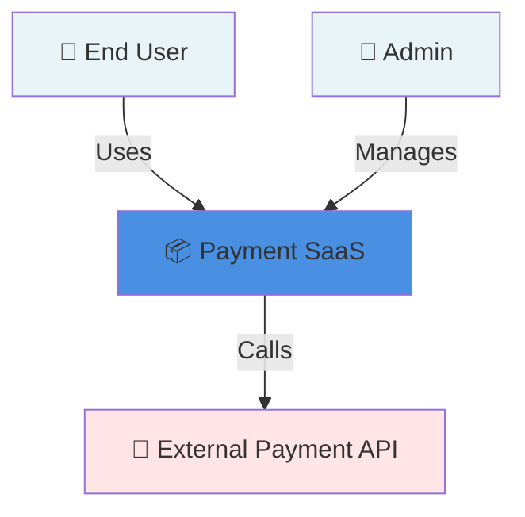

**When to use:** Project overview. First diagram in AGENTS.md.

---

## Type 2: Container Diagram (C4 Level 2)

**Use case:** Show major applications/databases/services within your system.

### Mermaid code: (2)

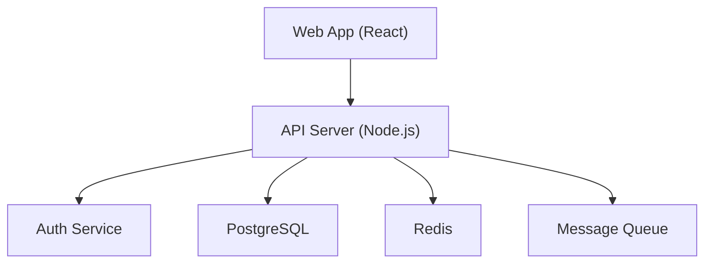

**When to use:** Architecture docs. Module README files. First document for new engineers.

---

## Type 3: Component Diagram (C4 Level 3)

**Use case:** Internal structure of one container. What components/modules are inside?

### Mermaid code: (3)

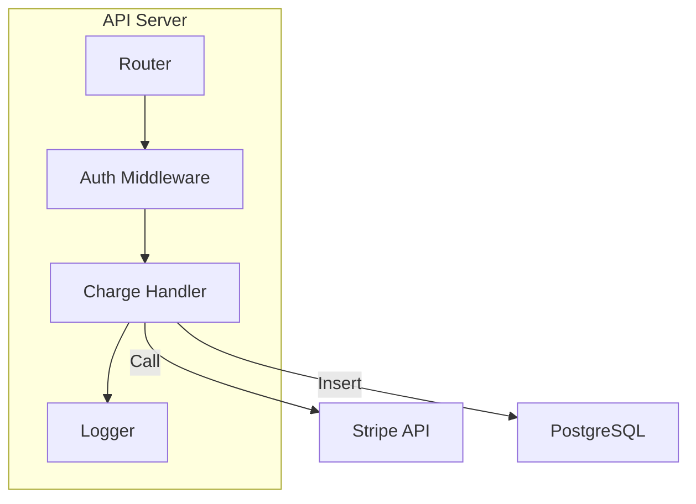

**When to use:** Deep-dive docs for a specific service. Code review guidance.

---

## Type 4: Sequence Diagram

**Use case:** Step-by-step message flow for a specific user action.

### Mermaid code: (4)

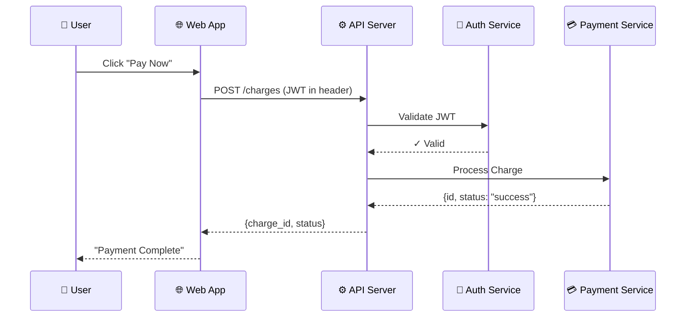

**When to use:** Feature documentation. Onboarding new devs. Debugging flows.

---

## Type 5: State Diagram

**Use case:** What states can an entity be in? How do they transition?

### Mermaid code: (5)

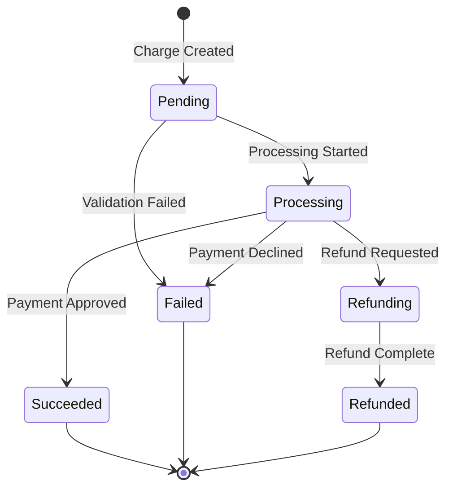

**When to use:** Explaining order/charge/subscription lifecycle. State machine docs.

---

## Type 6: Flowchart (Data Flow or Process)

**Use case:** Algorithm, business logic, or process flow.

### Mermaid code: (6)

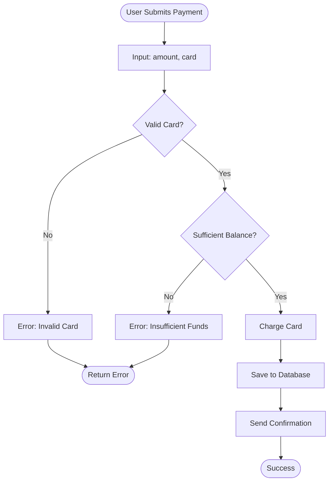

**When to use:** Algorithm explanations. Decision logic. Validation rules.

---

## Type 7: Entity Relationship Diagram (ER)

**Use case:** Database schema relationships.

### Mermaid code: (7)

```mermaid
erDiagram
    USER ||--o{ CHARGE : has
    CHARGE ||--o{ REFUND : "may have"
    USER { int user_id PK }
    CHARGE { int charge_id PK, decimal amount }
    REFUND { int refund_id PK, decimal amount }
```

**When to use:** Database documentation. Schema evolution docs.

---

## Type 8: Deployment Diagram

**Use case:** How is the system deployed? What runs where?

### Mermaid code: (8)

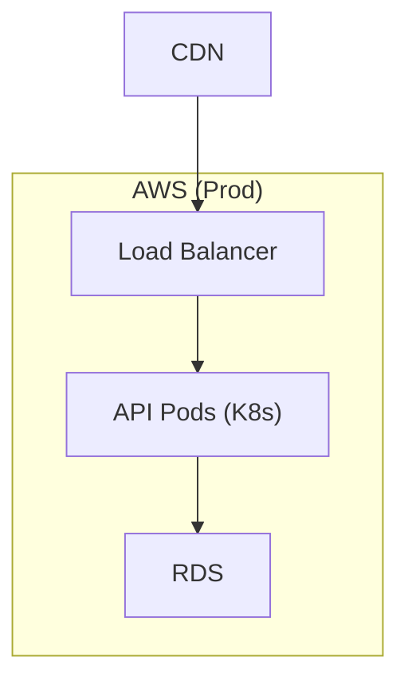

**When to use:** DevOps docs. Infrastructure overview.

---

## Advanced Pattern: Async Message Flows

Show Service A publishes to queue, Service B consumes.

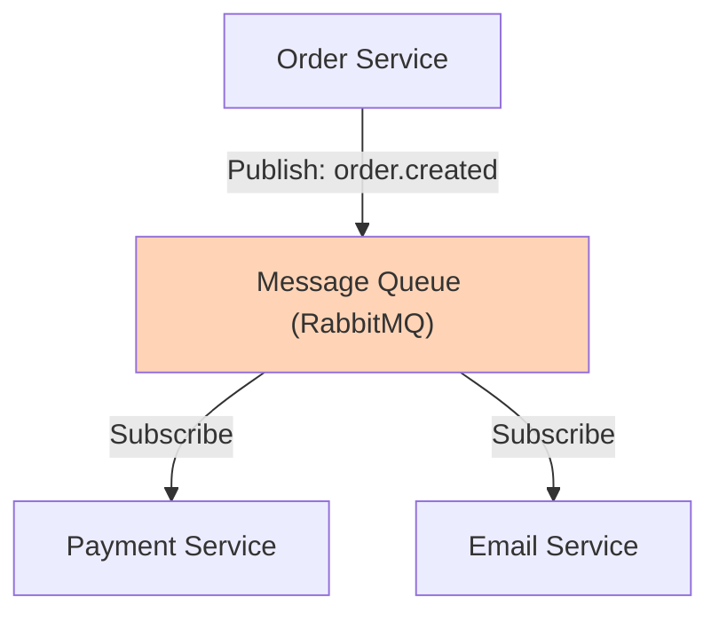

---

## Advanced Pattern: Conditional Flows

Show different paths based on conditions (success/failure).

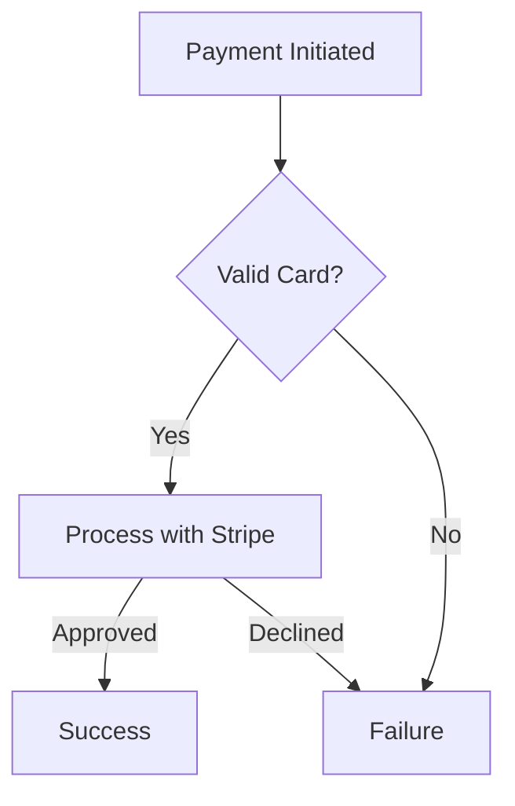

---

## Advanced Pattern: Multiple Environments

Show architecture differences by environment.

```mermaid
graph TB
    Web["Web App"]
    API["API Server"]
    DB["Database"]

    Web --> API
    API --> DB

    note over DB
        DEV: Postgres (local)
        STAGING: RDS (AWS)
        PROD: RDS + read replicas (AWS)
    end
```

---

## Advanced Pattern: Decision Tree for AI Agents

Help AI agent understand "when should you call which service?"

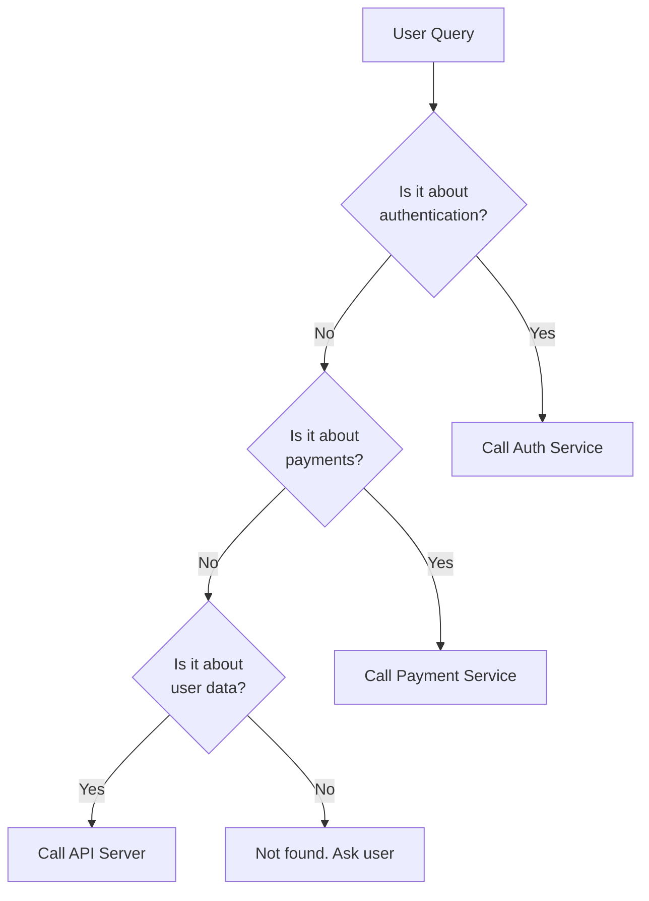

---

## Optimization Rules for LLM Parsing

### Rule 1: Keep Diagrams Focused (Max 15-20 Nodes)

#### Good (LLM Clear)

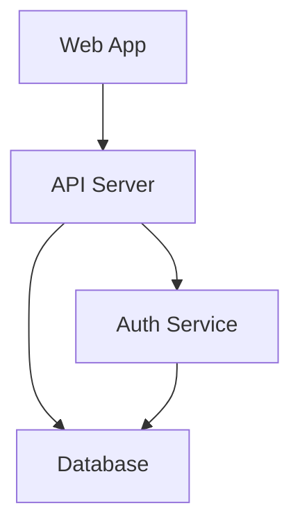

### Rule 2: Use Descriptive Labels, Not Abbreviations

#### Good

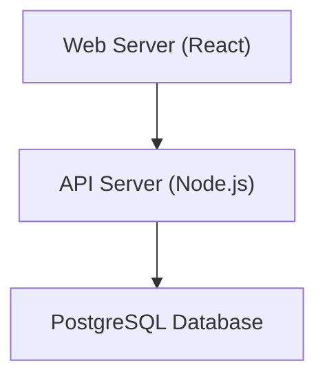

### Rule 3: Add Comments for Context

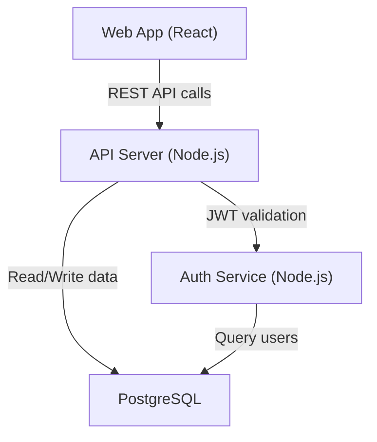

### Rule 4: One Diagram = One Concern

Don't mix deployment boxes, service boxes, databases, external APIs, user roles, and message flows in one diagram. Use separate diagrams per concern.
