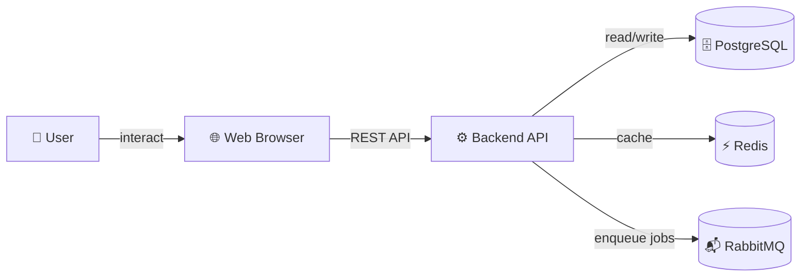

# AGENTS.md

_Primary entry point for AI agents (both human-reading-friendly and AI-consumable). Keep under 500 lines. Update whenever architecture changes materially. This is what an AI agent reads first._

## Project Overview

[**Project Name**]

[2-3 sentence description: What is this project? Who uses it? What problem does it solve?]

Examples:

- "MyBank CLI is a command-line tool for fetching bank balances, processing transactions, and generating reconciliation reports. Used by accounting teams at enterprise clients."
- "SearchEngine is a distributed full-text search platform with support for 50+ languages, real-time indexing, and sub-50ms query latency. Designed for SaaS companies scaling beyond single-node Elasticsearch."

## Tech Stack

| Component            | Technology           | Version  | Notes                               |
| -------------------- | -------------------- | -------- | ----------------------------------- |
| Runtime              | Node.js              | 20.x LTS |                                     |
| Language             | TypeScript           | 5.3+     | Strict mode enabled                 |
| Package Manager      | pnpm                 | 8.x      |                                     |
| Framework (Backend)  | Express              | 4.18+    |                                     |
| Framework (Frontend) | React                | 18.2+    | Server Components enabled           |
| Database             | PostgreSQL           | 15+      | JSONB fields for flexible schema    |
| Cache                | Redis                | 7.x      | Used for sessions and rate limiting |
| Message Queue        | RabbitMQ             | 3.12+    | Async job processing                |
| Container Runtime    | Docker               | 24+      |                                     |
| Orchestration        | Kubernetes           | 1.27+    | EKS on AWS                          |
| Monitoring           | Prometheus + Grafana | Latest   |                                     |

## Project Structure

```text
project-root/
├── README.md                    # User-facing overview
├── AGENTS.md                    # This file
├── CONTRIBUTING.md              # Contributor workflow
├── LICENSE                      # Apache 2.0
├── package.json
├── pnpm-lock.yaml
├── tsconfig.json
│
├── src/                         # Source code (mirrors folder structure)
│   ├── backend/
│   │   ├── api/                 # Express route handlers
│   │   ├── services/            # Business logic
│   │   ├── models/              # Data models (TypeORM entities)
│   │   ├── middleware/          # Auth, logging, error handling
│   │   └── README.md            # Backend-specific docs
│   │
│   ├── frontend/
│   │   ├── components/          # React components
│   │   ├── pages/               # Next.js page structure
│   │   ├── hooks/               # Custom React hooks
│   │   ├── lib/                 # Utilities (not React-specific)
│   │   └── README.md            # Frontend-specific docs
│   │
│   ├── shared/                  # Code used by both backend and frontend
│   │   ├── types.ts             # Shared TypeScript interfaces
│   │   └── constants.ts         # Shared constants
│   │
│   └── scripts/                 # Build, migration, dev scripts
│
├── tests/                       # Test suite
│   ├── unit/                    # Unit tests (alongside source)
│   ├── integration/             # Integration tests
│   ├── e2e/                     # End-to-end tests
│   └── fixtures/                # Mock data and test utilities
│
├── docs/                        # Documentation (required reading for AI agents)
│   ├── adr/                     # Architecture Decision Records (numbered)
│   │   ├── 0001-use-typescript.md
│   │   ├── 0002-postgres-over-mongodb.md
│   │   └── README.md
│   │
│   ├── architecture/            # System design diagrams and explanations
│   │   ├── c4-overview.md       # C4 Level 1-2
│   │   ├── data-flow.md         # Request/response flow
│   │   └── deployment.md        # Infrastructure layout
│   │
│   ├── api/                     # API documentation
│   │   ├── endpoints.md         # All endpoints, parameters, responses
│   │   └── authentication.md    # JWT, sessions, OAuth
│   │
│   ├── deployment/              # How to deploy to production
│   │   ├── environment-setup.md # Local dev, staging, production configs
│   │   ├── ci-cd.md             # GitHub Actions, build/test/deploy pipeline
│   │   └── monitoring.md        # Alerting, dashboards, SLOs
│   │
│   ├── known-issues.md          # Documented bugs/limitations (critical!)
│   └── ROADMAP.md               # Planned features and deprecations
│
├── config/                      # Configuration files (not secrets)
│   ├── .env.example             # Template for environment variables
│   ├── database.config.json     # DB connection, migration settings
│   └── docker-compose.dev.yml   # Local development containers
│
└── .github/
    ├── workflows/
    │   ├── test.yml             # Run unit and integration tests on PR
    │   ├── build.yml            # Build Docker image
    │   └── deploy.yml           # Deploy to production
    │
    └── ISSUE_TEMPLATE/
        ├── bug_report.md
        └── feature_request.md
```

## Key Conventions

### Naming and Casing

- **Files:** kebab-case (e.g., `user-service.ts`)
- **Directories:** kebab-case (e.g., `src/backend/api/`)
- **Exported functions/classes:** PascalCase for classes, camelCase for functions
- **Constants:** UPPER_SNAKE_CASE
- **CSS classes:** kebab-case (e.g., `user-card__title`)

### Code Organization

- **One exported entity per file** (unless tightly coupled utility functions)
- **Index files** (index.ts) re-export public API only
- **Absolute imports:** Configure TypeScript to support `@api/`, `@services/` aliases
- **Error handling:** All async functions must handle rejections; use custom AppError class

### API Design

- **Endpoints:** RESTful conventions (GET `/users/:id`, POST `/users`, PATCH `/users/:id`)
- **Request/Response:** JSON only
- **Versioning:** URL-based (`/api/v1/users`); new major versions get new base path
- **Status codes:** 200 (success), 201 (created), 400 (client error), 401 (auth), 404 (not found), 500 (server error)
- **Error format:** `{ error: string, code: string, details?: object }`

### Database

- **Migrations:** Numbered sequentially (001_create_users_table.sql)
- **Naming:** Table names are plural (users, transactions); field names are snake_case
- **Foreign keys:** Enforced at database level; always include index
- **Timestamps:** All tables have `created_at` and `updated_at` (UTC)

### Testing

- **Minimum coverage:** 80% for services, 60% for utilities (UI components exempt)
- **Test naming:** `describe('UserService', () => { it('should fetch user by ID', ...) })`
- **Mocking:** Use `jest.mock()` for external dependencies; prefer integration tests for business logic

### Git Workflow

- **Branches:** `feature/name`, `bugfix/name`, `chore/name`, `docs/name`
- **Commit format:** `[type]: description` (e.g., `[feat]: add user authentication`, `[fix]: handle null session`)
- **PR requirement:** Minimum 1 approval, CI must pass, no direct commits to main
- **Squash on merge:** Keep main history clean

### Documentation in Code

- **Functions:** JSDoc with @param, @returns, @throws
- **Complex logic:** Explain "why" not "what"
- **TODO comments:** Include author initials and date (e.g., `// TODO (jdoe, 2026-04-12): optimize query`)
- **Deprecated:** Mark with @deprecated and link to replacement

## Architecture Overview

### C4 Level 1: System Context



#### Key Components

- **Frontend (React/Next.js):** Renders UI, handles client-side routing, real-time updates via WebSocket
- **Backend (Express):** REST API, business logic, database queries, background job processing
- **Database (PostgreSQL):** Relational schema, ACID transactions, full-text search capability
- **Cache (Redis):** Session storage, rate limiting, frequently accessed data
- **Queue (RabbitMQ):** Decouples long-running tasks (email, reports) from user requests

#### Data Flow

1. User submits form in browser
2. Frontend validates input, sends POST to `/api/v1/resource`
3. Backend receives request, authenticates user (JWT from session), validates payload
4. Backend executes business logic, writes to PostgreSQL
5. Backend enqueues background job to RabbitMQ (e.g., send confirmation email)
6. Backend returns 201 response with resource ID
7. Frontend updates UI optimistically, receives confirmation
8. Background worker processes job asynchronously

### C4 Level 2: Container Diagram

See `docs/architecture/c4-overview.md` for detailed container breakdown.

## Important Files

| File                                     | Purpose                                                     | Owner            |
| ---------------------------------------- | ----------------------------------------------------------- | ---------------- |
| `src/backend/api/routes.ts`              | All endpoint definitions; entry point for understanding API | Backend Team     |
| `src/backend/services/UserService.ts`    | Business logic for user operations (create, read, update)   | Backend Team     |
| `src/backend/models/User.ts`             | TypeORM entity defining database schema                     | Backend Team     |
| `src/frontend/pages/dashboard.tsx`       | Main user dashboard (React Server Component)                | Frontend Team    |
| `src/frontend/components/UserCard.tsx`   | Reusable user display component                             | Frontend Team    |
| `src/shared/types.ts`                    | Shared TypeScript interfaces between frontend and backend   | Both Teams       |
| `docs/adr/0002-postgres-over-mongodb.md` | Explains why PostgreSQL was chosen                          | Architecture     |
| `docs/api/endpoints.md`                  | Complete API reference (autogenerated from code)            | Backend Team     |
| `docs/known-issues.md`                   | List of known bugs and workarounds                          | Engineering Lead |
| `.env.example`                           | Template for environment variables                          | DevOps Team      |

## Known Issues

See `docs/known-issues.md` for documented limitations and bugs. This file is critical: it prevents AI (and humans) from incorrectly "fixing" known limitations.

### Quick reference

- User export for datasets >100K rows times out (workaround: use async export job)
- Search across related tables has 500ms+ latency (under investigation)
- See docs/known-issues.md for full tracking and planned fixes

## Further Reading

### Getting Started

1. **Local Development Setup:** See `docs/deployment/environment-setup.md`
2. **API Overview:** Start with `docs/api/endpoints.md` for all available endpoints
3. **Architecture:** Read `docs/architecture/c4-overview.md` for system design
4. **Contributing:** See `CONTRIBUTING.md` for PR workflow and standards

### Deep Dives

- **Backend-specific:** `src/backend/README.md` (services, middleware, database)
- **Frontend-specific:** `src/frontend/README.md` (components, hooks, styling)
- **Decision history:** `docs/adr/` folder (why we built things the way we did)
- **Deployment:** `docs/deployment/ci-cd.md` (GitHub Actions, production pipeline)

### Documentation Layers

- **Global:** AGENTS.md (this file), README.md, CONTRIBUTING.md
- **System:** Module-level READMEs, ADRs, architecture docs
- **Local:** JSDoc in code, inline comments, TypeScript types

### External Resources

- **TypeScript Handbook:** <https://www.typescriptlang.org/docs>
- **Express Best Practices:** <https://expressjs.com/en/advanced/best-practice-security.html>
- **React Documentation:** <https://react.dev> (especially Server Components)
- **PostgreSQL Docs:** <https://www.postgresql.org/docs/15>

---

**Last Updated:** [DATE]  
**Maintained By:** [TEAM]  
**Status:** Active
